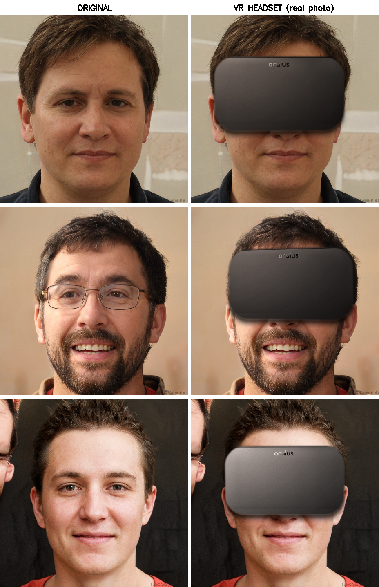

# VR Headset Pipeline

Batch tool that overlays a **photorealistic VR headset** over the eyes/upper face
of every portrait in a folder, while preserving the lower face (nose, mouth, jaw).
Fully local — no API key, no network, no GPU required.



*Left: original · Right: photoreal real-photo composite.*
A wipe-reveal demo is rendered to [`demo.mp4`](demo.mp4).

---

## How it works

Each image flows through four stages:

```
  image ─▶ 1. face landmarks ─▶ 2. head pose ─▶ 3. composite headset ─▶ output
```

### 1. Face landmarks — `face_detector.py`
Uses **MediaPipe FaceLandmarker** (`assets/face_landmarker.task`, 478 points) to
locate temples, forehead, nose bridge, eyes (iris), and ears. From these it builds
a `region` descriptor:

- a **temple-to-temple bounding box** over the eyes/upper face (where the headset goes),
- **interpupillary distance (IPD)** for physically-plausible scaling,
- **ear anchors**, in-plane **roll**, and the full **head-pose rotation**.

If no face is found, the image is skipped (reported in the summary).

### 2. Head pose — `head_pose.py`
**6DRepNet360** (ResNet-50 backbone, `assets/6DRepNet360.pth`) regresses a
continuous 6D rotation and converts it to a full 3×3 rotation matrix `R` — robust
on turned/tilted heads. If `torch`/weights are unavailable it **falls back to
`solvePnP`** on six landmarks (Euler angles). The matrix drives the perspective
warp so the headset tracks head yaw/pitch/roll.

### 3. Compositing the headset
Two renderers share one set of compositing helpers (lighting analysis, perspective
warp, skin-seating, color grade) in `overlay_engine.py`:

| Path | File | Used when | Look |
|------|------|-----------|------|
| **Real-photo (default)** | `real_compositor.py` | overlay mode, asset present | **Photoreal** — composites an actual headset photograph |
| Procedural (fallback) | `overlay_engine.py` + `headset_renderer.py` | real asset missing | Drawn Quest-3-style sprite (CGI-looking) |
| AI inpainting (optional) | `ai_engine.py` | `--mode ai` + API token | Stable-Diffusion generated |

**Why a real photo?** Procedurally *drawing* a headset has a hard realism ceiling
— it always reads as CGI. Compositing a real product photograph brings genuine
materials, foam, fabric and studio highlights for free. The real-photo compositor
(`real_compositor.py`) does the work of *seating* that photo into the scene:

1. **Crop to the visor plate.** The source photo (`assets/real/rift_front2.png`,
   a straight-on Oculus Rift CV1 front view) is cropped with a rounded-rectangle
   alpha mask (`_VISOR_BOX`) that keeps the eye-covering face plate and removes the
   splaying side-arms / pivots that would otherwise float over the cheeks.
2. **Relight** to the scene's color temperature and exposure (sampled from
   forehead + cheeks) so the device belongs in *this* photo.
3. **3D-warp** to the head-pose matrix `R`, scaled so the visor spans temple-to-temple
   and dropped onto the eye line.
4. **Seat on skin:** ambient occlusion + a tight **contact shadow** under the foam
   edge so the bottom doesn't look pasted on, plus a subtle skin-tone bleed.
5. **Alpha-composite** and apply a gentle local contrast/vignette grade to unify grain.

### 4. Output
The result is written to the output path, mirroring the input folder structure.
Only the eye/upper-face region is altered; the rest of the photo is untouched.

---

## Project structure

```
vr-headset-pipeline/
├── pipeline.py            # CLI batch driver (entry point)
├── face_detector.py       # MediaPipe landmarks → region descriptor
├── head_pose.py           # 6DRepNet360 head pose (solvePnP fallback)
├── real_compositor.py     # ★ photoreal real-photo compositor (default)
├── overlay_engine.py      # shared compositing helpers + procedural fallback
├── headset_renderer.py    # procedural Quest-3-style sprite (fallback only)
├── ai_engine.py           # optional Stable-Diffusion inpainting (--mode ai)
├── make_demo_video.py     # renders the before/after wipe-reveal demo.mp4
├── try_real.py            # quick iteration harness for tuning the fit
├── requirements.txt
├── assets/
│   ├── face_landmarker.task     # MediaPipe model
│   ├── 6DRepNet360.pth          # head-pose weights
│   └── real/rift_front2.png     # real headset photo (the realism asset)
├── input/                 # source portraits
└── output/                # results
```

---

## Installation

Requires **Python 3.10+**.

```powershell
# (optional) virtual environment
python -m venv .venv
.\.venv\Scripts\Activate.ps1

pip install -r requirements.txt
```

Notes:
- `torch` / `torchvision` / `timm` are only needed for 6DRepNet360 pose. CPU-only
  torch is fine. Without them, the pipeline still runs using the `solvePnP` fallback.
- `replicate` / `requests` are only needed for `--mode ai`.

---

## Usage

```powershell
# Photoreal overlay (default) — batch a folder
python pipeline.py --input ./input --output ./output

# Single image
python pipeline.py --input photo.jpg --output result.jpg

# AI inpainting mode (needs a Replicate token)
$env:REPLICATE_API_TOKEN = "your_key_here"
python pipeline.py --input ./input --output ./output --mode ai
```

### Options

| Flag | Default | Description |
|------|---------|-------------|
| `--input`, `-i`  | *(required)* | Input folder or single image file |
| `--output`, `-o` | *(required)* | Output folder or single image file |
| `--mode`, `-m`   | `overlay` | `overlay` (photoreal, local) · `ai` (Replicate inpainting) |
| `--ext`          | `jpg,jpeg,png,webp` | Comma-separated extensions to process |
| `--workers`, `-w`| `4` | Parallel workers (auto-set to 1 when the CPU pose-net is active) |

Typical throughput: **~3 s/image** on CPU (dominated by 6DRepNet360).

---

## Tuning the fit

The real-photo compositor exposes a few knobs (see `real_compositor.composite`):

| Param | Default | Effect |
|-------|---------|--------|
| `scale`   | `1.06` | Headset width as a multiple of temple-to-temple width |
| `y_bias`  | `0.30` | Vertical offset (fraction of region height) — drops the visor onto the eye line |
| `variant` | `"visor"` | `"visor"` = clean face plate · `"full"` = keep side arms |

Iterate quickly without touching the pipeline:

```powershell
# args: scale  y_bias  variant  out_dir
python try_real.py 1.06 0.30 visor output_real
```

---

## Regenerating the demo & comparison

```powershell
# Before/after wipe-reveal video (reads input/ as BEFORE, output/ as AFTER)
python make_demo_video.py        # → demo.mp4
```

The `comparison.png` montage (original · procedural · real-photo) is produced by an
inline script; re-run the pipeline first so `output/` holds fresh results.

---

## Assets & attribution

- **Headset photo** (`assets/real/rift_front2.png`): an Oculus Rift CV1 front-view
  cut-out (transparent PNG) sourced from StickPNG, used here for a personal/research
  image pipeline. Swap in a different headset by replacing this file and re-checking
  `_VISOR_BOX` in `real_compositor.py`.
- **MediaPipe FaceLandmarker** model and **6DRepNet360** weights ship in `assets/`.

---

## Limitations

- Compositing works best on **roughly frontal** faces (large yaw/pitch reduces realism).
- The default asset is an **Oculus Rift CV1**; for a specific model (e.g. Quest 3),
  swap the asset and re-tune `_VISOR_BOX` / `scale`.
- Extreme lighting (strong colored side light) may not fully match after relighting.
- One face per image (`num_faces=1`); multi-face support would need a detect loop.

## Troubleshooting

- **"No face detected"** → ensure the face is reasonably large and frontal; check the
  image isn't rotated.
- **Headset looks like the old CGI bar** → the real asset is missing; confirm
  `assets/real/rift_front2.png` exists (overlay mode falls back to the procedural draw).
- **Pose seems off / always frontal** → `torch` or `6DRepNet360.pth` not loaded;
  the pipeline is using the `solvePnP` fallback. Install the torch extras.
